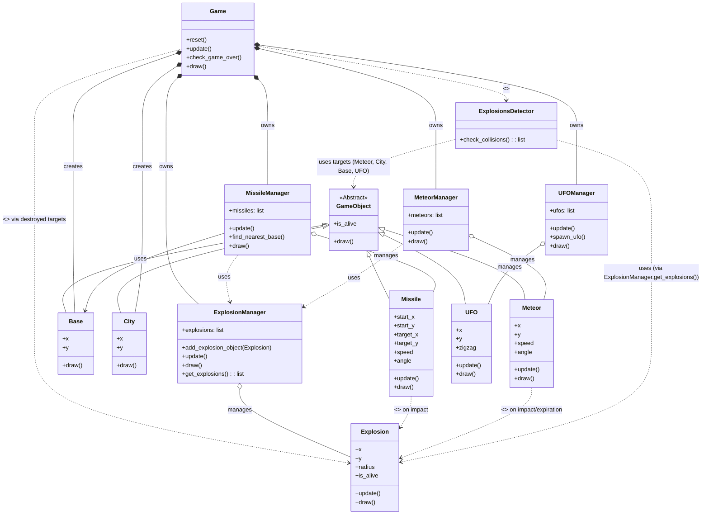

```mermaid
classDiagram
    direction TD

    class Game {
        +reset()
        +update()
        +check_game_over()
        +draw()
    }
    class GameObject {
        <<Abstract>>
        +is_alive
        +draw()
    }
    class ExplosionManager {
        +explosions: list
        +add_explosion_object(Explosion)
        +update()
        +draw()
        +get_explosions(): list
    }
    class MeteorManager {
        +meteors: list
        +update()
        +draw()
    }
    class MissileManager {
        +missiles: list
        +update()
        +find_nearest_base()
        +draw()
    }
    class UFOManager {
        +ufos: list
        +update()
        +spawn_ufo()
        +draw()
    }
    class ExplosionsDetector {
        +check_collisions(): list
    }
    class Explosion {
        +x
        +y
        +radius
        +is_alive
        +update()
        +draw()
    }
    class Base {
        +x
        +y
        +draw()
    }
    class City {
        +x
        +y
        +draw()
    }
    class Meteor {
        +x
        +y
        +speed
        +angle
        +update()
        +draw()
    }
    class Missile {
        +start_x
        +start_y
        +target_x
        +target_y
        +speed
        +angle
        +update()
        +draw()
    }
    class UFO {
        +x
        +y
        +zigzag
        +update()
        +draw()
    }

    GameObject <|-- City
    GameObject <|-- Meteor
    GameObject <|-- Missile
    GameObject <|-- Base
    GameObject <|-- UFO

    Game *-- ExplosionManager : owns
    Game *-- MeteorManager    : owns
    Game *-- MissileManager   : owns
    Game *-- UFOManager       : owns
    Game *-- Base             : creates
    Game *-- City             : creates

    Game ..> Explosion : <<creates>> via destroyed targets
    Game ..> ExplosionsDetector : <<configures>>

    MissileManager --> Base : uses
    MissileManager ..> ExplosionManager : uses
    MeteorManager ..> ExplosionManager : uses

    ExplosionManager o-- Explosion : manages

    Missile ..> Explosion : <<creates>> on impact
    Meteor ..> Explosion : <<creates>> on impact/expiration

    ExplosionsDetector ..> Explosion : uses (via ExplosionManager.get_explosions())
    ExplosionsDetector ..> GameObject : uses targets (Meteor, City, Base, UFO)

    MeteorManager o-- Meteor : manages
    MissileManager o-- Missile : manages
    UFOManager o-- UFO : manages
```
