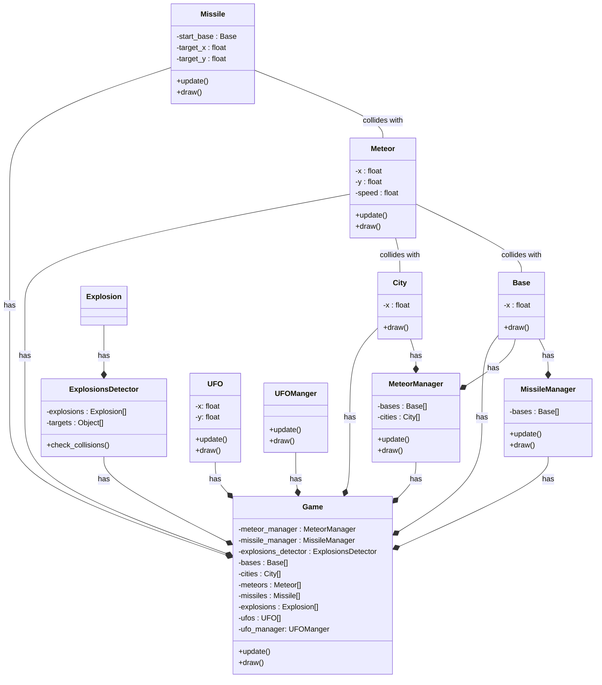

```mermaid
classDiagram
    class Game {
        -meteor_manager : MeteorManager
        -missile_manager : MissileManager
        -explosions_detector : ExplosionsDetector
        -bases : Base[]
        -cities : City[]
        -meteors : Meteor[]
        -missiles : Missile[]
        -explosions : Explosion[]
        -ufos : UFO[]
        -ufo_manager: UFOManger
        +update()
        +draw()
    }
    class MeteorManager {
        -bases : Base[]
        -cities : City[]
        +update()
        +draw()
    }
    class MissileManager {
        -bases : Base[]
        +update()
        +draw()
    }
    class ExplosionsDetector {
        -explosions : Explosion[]
        -targets : Object[]
        +check_collisions()
    }
    class Meteor {
        -x : float
        -y : float
        -speed : float
        +update()
        +draw()
    }
    class Missile {
        -start_base : Base
        -target_x : float
        -target_y : float
        +update()
        +draw()
    }
    class City {
        -x : float
        +draw()
    }
    class Base {
        -x : float
        +draw()
    }
    class UFO {
        -x: float
        -y: float
        +update()
        +draw()
    }

    class UFOManger {
      +update()
      +draw()
    }

MeteorManager --* Game : has
MissileManager --* Game : has
ExplosionsDetector --* Game : has
Base --* Game : has
City --* Game : has
Meteor --* Game : has
Missile --* Game : has
UFO --* Game : has
UFOManger --* Game : has
Base --* MeteorManager : has
City --* MeteorManager : has
Base --* MissileManager : has
Explosion --* ExplosionsDetector : has
Meteor -- City : collides with
Meteor -- Base : collides with
Missile -- Meteor : collides with
```
